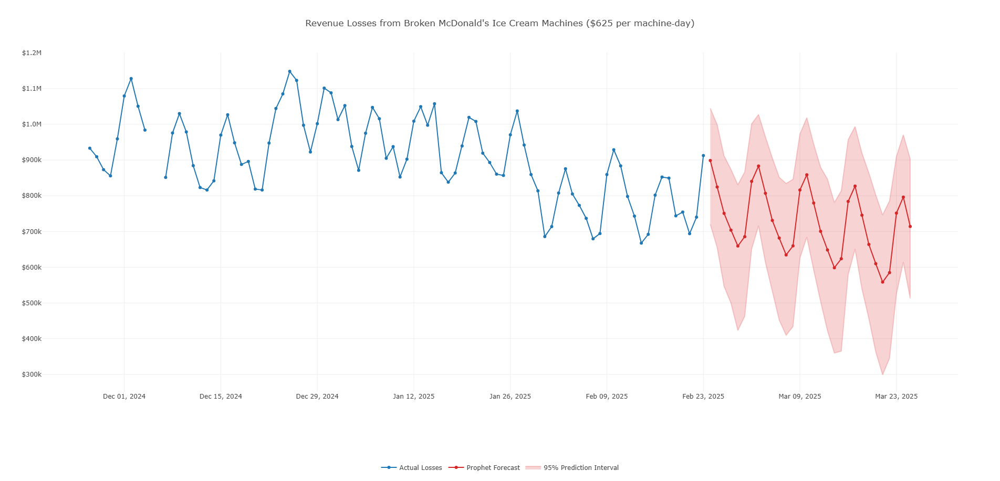

# [mcbroken-forecasting](https://sites.google.com/view/isaac-liu/demos/live-mcbroken-forecasts)

Live Time Series Forecasting of McDonald's Ice Cream Machine Outages

Isaac Liu

This project implements and compares three different time series forecasting methods to predict revenue losses from McDonald's ice cream machine outages. Using data from [mcbroken.com](https://mcbroken.com/) gathered, scraped, and processed at 12PM PST each day (if you'd like some easy-to-work-with historical data, see my repo [here](https://github.com/ijyliu/mcbroken-daily-historical)), these models predict future outages and associated revenue impacts, estimated at $625 per machine-day of downtime. Live daily forecasts are hosted on my [Google Sites page](https://sites.google.com/view/isaac-liu/demos/live-mcbroken-forecasts) along with detailed methodology writeups and insights from historical test-set analysis.

The forecasting models include:

- **Prophet**: Facebook's advanced time series forecasting library (Best performer with ~7% MAPE and half the MAE of a 7-day seasonal naive method)
- **ARIMA**: Auto-Regressive Integrated Moving Average model with seasonal components
- **Exponential Smoothing**: Holt-Winters Damped Trend model with trend and seasonality

Each implementation features Box-Cox transformations to standardize variance, handling of outliers and missing data with exogenous regressors or imputation, Bayesian hyperparameter optimization and/or stepwise search, and built-in or bootstrapped 95% prediction interval generation.

The data retrieval and cleaning pipeline, as well as each forecasting method and associated dependencies, were containerized and deployed as daily scheduled AWS Lambda functions. This creates interactive HTML visualizations with detailed forecasts for the next 30 days ready for retrieval from an S3 bucket.

## Technologies (not exhaustive!)

- Python
  - pmdarima
  - Prophet
  - statsmodels
  - Optuna
  - Plotly
  - Pandas
  - Numpy
  - SciPy
  - Conda (Mamba)
- Cloud & Deployment (AWS, Docker)
  - Lambda
  - S3
  - DynamoDB
  - Elastic Container Registry (ECR)
  - Eventbridge
- Bash
